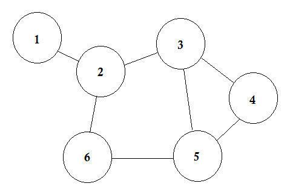

# 웹 앱 API 개발을 위한 GraphQL

Learning GraphQL by Eve Porcello and Alex Banks(O'Reilly). Copyright 2018 Moon Highway, LLC, 978-1-492-03071-3

## 1장 GraphQL에 오신 것을 환영합니다.

### GraphQL 이란?

API를 만들 때 사용할 수 있는 쿼리언어

### 개요

GraphQL은 **선언형**(declarative) 데이터 페칭(fetching) 언어라고 흔히 일컬어짐. <br />
그러므로 개발자는 '무슨' 데이터가 필요한지에 대한 요구사항만 작성하면 되고 '어떻게' 가져올지는 신경 쓰지 않아도 됨.

### GraphQL 설계 원칙

- 위계적: 필드안에 다른 필드가 중첩될 수 있으며, 쿼리와 그에 대한 반환 데이터는 형태가 서로 같음
- 제품 중심적: 클라이언트가 요구하는 데이터와 클라이언트가 지원하는 언어 및 런타임에 맞춰 동작함
- 엄격한 타입 제한: GraphQL 서버는 GraphQL 타입 시스템을 사용함. 스키마의 데이터 포인트마다 특정 타입이 명시되며, 이를 기초로 유효성 검사를 받게됨
- 클라이언트 맞춤 쿼리: 클라이언트 쪽에서 받아서 사용할 수 있는 데이터를 제공함
- 인트로스펙티브(introspective): GraphQL 서버가 사용하는 타입시스템에 대한 쿼리를 작성할 수 있음

### REST

[REST API 제대로 알고 사용하기](https://meetup.toast.com/posts/92) <br />
리소스 네트워크는 가상 상태 머신(virtual state machine)이며 행동(GET, PUT, POST, DELETE)은 머신 내의 상태를 바꿈. <br />
예를 들어 각 라우트를 통해 정보를 요청하면 그에 따라 응답이 다르게 옴.

### REST의 단점

- 오버페칭: 예를 들어 다음과 같은 JSON 데이터가 있다고 가정할 때 사용할 필드가 'name'하나 더라도 모든 데이터를 받아야 하는 경우
  ```
  {
    "name": "Luke Skywalker",
    "height":  "172",
    "mass": "77",
    "hair_color": "blond",
    "skin_color": "fair"
  }
  ```
- 언더페칭: PM이 새로운 기능을 추가하고 싶다고 하는 경우 경우에 따라 데이터를 요청하고 추가 데이터를 또 요청해야 하는 상황이 생길 수 있음
- 엔드포인트 관리: 클라이언트에 변경 사항이 생기면 대개 엔드포인트를 새로 만들어야 함

## 2장 그래프 이론

### 개요

그래프는 우리 주변 어디서나 찾아볼 수 있음<br/>
상호 연관된 사물이나 사람, 개념 또는 데이터를 다이어그램으로 표현할 수 있는 훌륭한 방법이기 때문임 <br/>
이에 대해 자세히 알아보려면 **그래프 이론**과 수학 그래프 이론의 원천을 자세히 들여다 봐야 함

### 그래프 이론 어휘

그래프 이론은 말 그대로 그래프에 대한 연구임 <br/>
데이터 포인트 객체와 이들 사이의 관계가 그래프라 생각하면 됨

이 그래프 다이어그램은 데이터 포인트를 나타내는 원 6개로 이루어져 있는데, <br/>
그래프 용어로 점은 노드(nodes) 혹은 정점(vertex)라고 부르며 노드 사이의 연결선은 엣지(edge)라고 함 <br/>
위 그래프는 총 7개의 엣지가 있음

그래프를 방정식으로 표현하면 G(그래프) = {V(노드의 집합), E(엣지의 집합)} 임

추가적인 설명은 아래를 참고할 것

- [위키 백과사전 - 그래프 이론](https://ko.wikipedia.org/wiki/%EA%B7%B8%EB%9E%98%ED%94%84_%EC%9D%B4%EB%A1%A0)
- [위키 백과사전 - 한붓그리기](https://ko.wikipedia.org/wiki/%ED%95%9C%EB%B6%93%EA%B7%B8%EB%A6%AC%EA%B8%B0)
- [위키 백과사전 - 트리구조](https://ko.wikipedia.org/wiki/%ED%8A%B8%EB%A6%AC_%EA%B5%AC%EC%A1%B0)
- [위키 백과사전 - 이진 탐색 트리](https://ko.wikipedia.org/wiki/%EC%9D%B4%EC%A7%84_%ED%83%90%EC%83%89_%ED%8A%B8%EB%A6%AC)

## 3장 GraphQL 쿼리어

## 4장 스키마 설계하기

## 5장 GraphQL API 만들기

## 6장 GraphQL 클라이언트

## 7장 실제 제품을 위한 GraphQL
